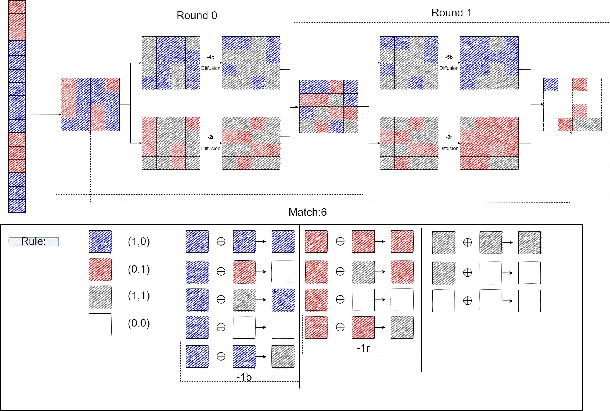

The framework of the entire process is shown in the figure.I fill the frame with the solution from running gurobi.The initial state is 6r and 10b.The real object of the model is to max(min(number of r,number of b,Match)).As shown in the figure,In the process of Diffusion,the number of r and b will decrease.The amount decreased corresponds to the variable in the model-"GCD_r{r}_Red/Blue".This corresponds to a rank found by the model.Its results are also where the model is wrong.

>  The process of Diffusion is to take the position of element 1 in each row of the Diffusion matrix, take out all the elements in the corresponding position of the input state, and carry out the XOR operation. With 16 lines, I can get 16 elements that make up the output state

